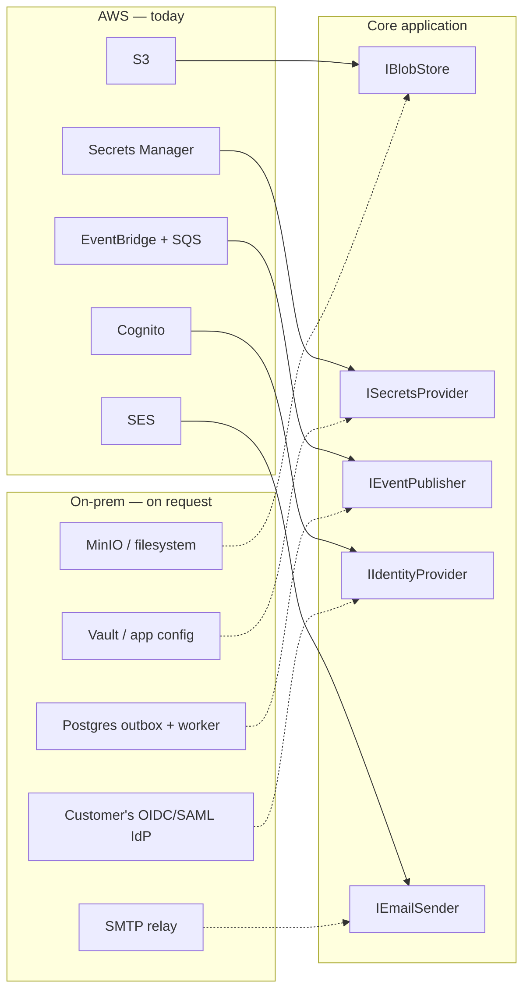
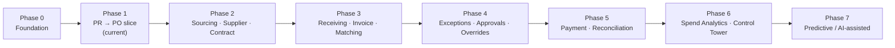

# P2P Platform — Architecture & Delivery Blueprint

**Status:** Draft v1 — foundation locked, infra sizing deferred
**Tenancy:** Schema-per-organisation
**Cloud:** AWS, behind portability interfaces (on-prem supported on request)

> A fully designed version of this document, with diagrams, is published at:
> https://claude.ai/code/artifact/9e8c8a8b-8036-4c47-a188-c7003dd41f4e

## 0. Summary

The platform is a configuration-driven P2P suite, not a set of CRUD screens: every
business document is versioned rather than overwritten, every approval runs through
one generic workflow engine, and every action is append-only audited. Three
structural decisions are locked and drive everything below:

1. Build a **thin vertical slice** (Foundation + Requisition→PO, end to end) before
   fanning out to the other ~15 modules.
2. Isolate tenants by giving each organisation its **own Postgres schema**, not a
   shared table with an `OrgId` column.
3. Keep the core engine **cloud-agnostic** so an on-prem deployment is a
   configuration change, not a rewrite.

AWS account sizing, RDS instance class, and Secrets Manager specifics are
intentionally deferred — this document defines the boundary those decisions plug
into later.

## 1. Technology stack

| Layer | Choice | Why here specifically |
|---|---|---|
| Database | PostgreSQL | Mandated by the requirements doc; JSONB covers configurable workflow rules without a second data store |
| Backend | C# / ASP.NET Core | Strong typing for financial fields; mature EF Core + Npgsql; async-first |
| Workflow engine | Custom, in-process | No off-the-shelf BPM engine models effective-dated, versioned approval chains cleanly |
| Background jobs | Hangfire (Postgres-backed) | OCR, matching, ERP sync, bulk import all need Job ID/status/retry; no extra broker needed on-prem |
| Frontend | React + TypeScript | 70+ worklist-style screens; TanStack Query/Table for server-side paging & sort |
| Mobile (later) | React Native | Shares component model and team skill with the web client |
| Object storage | S3-compatible | S3 on AWS, MinIO on-prem — one client implementation |
| IaC | AWS CDK (C#) | Same language as the backend |

## 2. Multi-tenant data model

Every organisation gets a **dedicated Postgres schema**, not a shared table filtered
by `OrgId`.

**The rule that prevents table-naming confusion:** table names never change per
organisation. Every schema (`org_acme`, `org_globex`, ...) contains an identical set
of tables. The organisation is encoded once — in which schema a connection is
pointed at — never in a table suffix or a WHERE clause a developer has to remember.

### Platform registry

```
platform.organisations
  organisation_id      uuid primary key
  org_code             text unique        -- 'acme'
  display_name         text
  schema_name          text unique        -- 'org_acme'
  deployment_target    text               -- 'aws' | 'onprem'
  connection_ref       text               -- secret name, resolved later
  schema_version       text               -- last migration applied
  status                text               -- 'provisioning' | 'active' | 'suspended'
  created_at_utc       timestamptz
```

### Request routing

```mermaid
sequenceDiagram
    participant U1 as User (org: acme)
    participant U2 as User (org: globex)
    participant API as API (single instance)
    participant Reg as platform.organisations
    participant DB as PostgreSQL (single instance)

    U1->>API: request
    API->>Reg: lookup schema by OrgId
    Reg-->>API: schema_name = org_acme
    API->>DB: query (search_path = org_acme)

    U2->>API: request
    API->>Reg: lookup schema by OrgId
    Reg-->>API: schema_name = org_globex
    API->>DB: query (search_path = org_globex)

    note over DB: org_acme and org_globex schemas hold<br/>identical table sets; app code never<br/>joins across schemas
```

### Isolation guarantees

- **No cross-schema joins in app code.** Platform-level admin reporting goes through
  a separate, explicitly-audited aggregation path.
- **Per-org backup/export.** `pg_dump --schema=org_acme` gives a clean single-tenant
  export — useful for data-portability requests and the on-prem escape hatch.
- **New org provisioning** = clone the current migration bundle into a freshly named
  schema and register it in `platform.organisations`.
- **Defense in depth (optional, per-org):** layer Postgres Row-Level Security on top
  of a sensitive organisation's schema if a contract requires it — the schema
  boundary is the primary control.

Implementation note: this repo's `AppDbContext` (see
`backend/P2P.Infrastructure/Persistence/AppDbContext.cs`) resolves
`ITenantContext.SchemaName` once per request and uses `HasDefaultSchema` in
`OnModelCreating`, combined with a custom `IModelCacheKeyFactory`
(`TenantModelCacheKeyFactory`) so EF Core compiles and caches one model per schema
instead of reusing the first tenant's model for everyone. Table names inside each
schema carry a module prefix (`organisation_*`, `identity_*`, `versioning_*`,
`audit_*`, `workflow_*`) so the logical grouping the requirements ask for is visible
in the table name itself, since Postgres schemas can't nest inside the tenant schema.

## 3. Deployment portability — AWS now, on-prem on request

The core application never talks to AWS directly. It depends on five narrow
interfaces; AWS services are one implementation of each, and an on-prem stack is
another.



Which side is wired in is a dependency-injection + configuration decision made at
deploy time, never a fork of the business logic.

| Concern | AWS today | On-prem, when requested |
|---|---|---|
| Container runtime | ECS Fargate | Docker Compose or customer's Kubernetes — same images |
| Database | RDS for PostgreSQL | Self-managed PostgreSQL — same schema, same migrations |
| Object storage | S3 | MinIO (S3-compatible API, same client code) |
| Business events | EventBridge + SQS | Postgres outbox table + polling worker |
| Identity | Cognito | Customer's own OIDC/SAML IdP |
| Secrets | Secrets Manager — *sizing deferred* | Vault, or environment-injected config |

## 4. Solution structure

```
/backend
  P2P.Domain            # entities, no framework dependencies
  P2P.Application         # use cases, workflow engine, CQRS handlers
  P2P.Infrastructure        # EF Core, tenant resolver, S3/blob, event outbox
  P2P.Api                    # ASP.NET Core Web API
  P2P.Workers                 # Hangfire background jobs
  P2P.Tests
/frontend                      # React + TS, Vite
/infra                          # AWS CDK (C#) — deferred until sizing is planned
/docs                            # this file
```

## 5. Foundation domain model (built so far)

| Group | Entities |
|---|---|
| Organisation | `LegalEntity`, `BusinessUnit`, `Department`, `CostCenter`, `Location` |
| Identity & authority | `User`, `Role`, `Permission`, `AuthorityAssignment` (effective-dated), `Delegation` |
| Versioning | `Document`, `DocumentVersion` (`Draft → PendingApproval → Active → Superseded/Rejected/Cancelled`) |
| Audit | `AuditLog`, `AuditFieldChange` — append-only by construction (private setters, factory method) |
| Workflow engine | `WorkflowDefinition → WorkflowVersion → WorkflowStep → WorkflowRule`, `WorkflowInstance`, `ApprovalTask` |

## 6. Vertical slice scope (next up)

| Area | Scope |
|---|---|
| Purchase Requisition | Create draft → submit → approve/reject via the generic workflow engine → cancel |
| Purchase Order | Generated from an approved PR → submit → approve → amend (new version; old stays queryable) → send to supplier |
| UI | Dashboard shell, My Requisitions + Create Requisition, My Approvals, PO Worklist + PO Detail with version history, minimal Admin |

## 7. Phased roadmap



## 8. Decision log

| Item | Status | Note |
|---|---|---|
| Tenancy model | Decided | Schema-per-organisation, identical table shape per schema |
| Build order | Decided | Foundation + Requisition→PO vertical slice first |
| Cloud target | Decided | AWS, behind portability interfaces |
| On-prem deployment | Decided | Supported via adapter swap, built when a customer needs it |
| AWS account / networking / RDS sizing | **Deferred** | Planned separately |
| Secrets Manager configuration | **Deferred** | Planned alongside RDS sizing |
| Identity provider (Cognito vs. Auth0/WorkOS) | Open | Cognito is the default; revisit before per-org SAML SSO is needed |
| Row-Level Security as defense-in-depth | Open | Adopt per-org only if a contract requires it |

## 9. Next steps

- [x] Scaffold the backend solution (`P2P.Domain/Application/Infrastructure/Api/Workers/Tests`)
- [x] Model the Foundation entities
- [x] Build the tenant-aware `AppDbContext` (schema-per-tenant model caching) and prove it compiles a migration
- [x] Scaffold the React + TS frontend shell
- [x] Stand up a local Postgres with two seeded org schemas (`org_acme`, `org_globex`) and prove request-level isolation end to end - done against a real local PostgreSQL 18 instance; see "Proven locally" below
- [ ] Automate the per-schema migration templating step (currently a manual `dotnet ef migrations script --idempotent` + schema-name substitution + `psql` apply, run once by hand - fine for two dev schemas, not for onboarding real organisations)
- [ ] Replace `ConfigOrganisationRegistry` with a real `platform.organisations`-backed implementation
- [ ] Build the generic workflow engine's evaluation logic
- [ ] Build Requisition → PO on top of the Foundation
- [ ] Revisit AWS account structure, RDS sizing, and Secrets Manager once the slice runs locally

### Proven locally

Local PostgreSQL 18, a dedicated low-privilege `p2p_app` role/database (never the
superuser), and two fully-migrated org schemas. Verified through the real API, not
just `psql`:

```
POST /api/v1/_diagnostics/legal-entities   (X-Org-Code: acme)   -> writes to org_acme
POST /api/v1/_diagnostics/legal-entities   (X-Org-Code: globex) -> writes to org_globex
GET  /api/v1/_diagnostics/legal-entities   (X-Org-Code: acme)   -> returns only Acme's row
GET  /api/v1/_diagnostics/legal-entities   (X-Org-Code: globex) -> returns only Globex's row
```

One real bug surfaced and fixed in the process: EF Core's own migrations-history
table (`__EFMigrationsHistory`) needs to be schema-qualified per tenant too, not just
the business tables - left unqualified it defaults to `public` and is shared across
every org, so the *second* organisation's migration apply silently no-ops (the first
org's history row satisfies the idempotent script's "already applied" check). Fixed
via `NpgsqlDbContextOptionsBuilder.MigrationsHistoryTable(name, schema)`, wired
through both `Program.cs` and `DesignTimeAppDbContextFactory`
(`ScopeMigrationsHistoryToTenant`).

Local Postgres connection string lives in **.NET user secrets**
(`dotnet user-secrets set ConnectionStrings:Postgres ... --project P2P.Api`), not in
`appsettings.json` - the checked-in file only has a non-functional placeholder.
